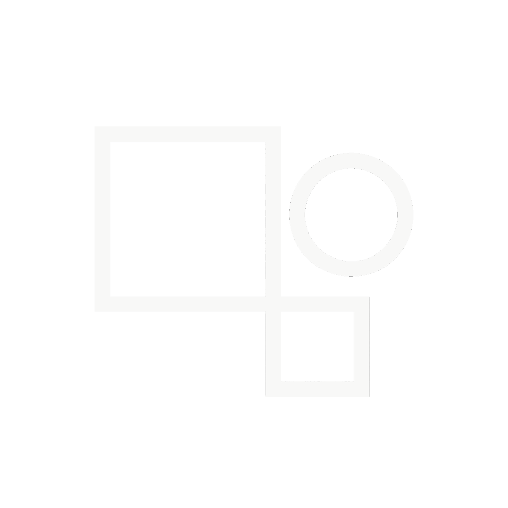

<h1 align="center">hg.studio Launcher</h1>

[
](https://github.com/kipawepro/hg.studioLauncher/actions) 

Participe a nos evenement minecraft en un seul clic !

## Fonctionalité

* 📂 Gestion des mods / modpacks / shaders.
  * Active & désactive les mods optionnels.
  * Plusieurs versions de modpack disponible dans le futur !
  * Gestion des shaders et sélection de shaders directement sur le launcher !
* ⬇️ installation simple et efficace.
  * Seulement quelques clics pour installer et lancer un modpack!
  * auto-réparation des fichier manquant ou casser ! (réinstallation du fichier).
* 📰 Reste a jours !
  * Utilisation de la technologie RSS permettant de recevoir automatiquement les dernières actualités.
* ⚙️ Paramètre complet.
  * Des paramètres simples complets. 
* 🔄Mise a jours du launcher automatique (En dev).
  * Mise a jours du launcher automatiser !

#### Besoin d'un reseignement? [Passe par notre wiki][wiki], ou alors rejoins notre [discord][discord].

#### Tu aime notre projet ??? alors n'hesite pas a metre une étoile ! 🌟

## Téléchargements :

Telechargement disponible depuis : [GitHub Releases](https://github.com/kipawepro/hg.studioLauncher/releases)

#### Dernière version

#### Dernière version test

**Platforms supporté :**

Telecharger le launcher depuis l'onglet [Releases](https://github.com/kipawepro/hg.studioLauncher/releases) de github, ou depuis notre [Site officiel de la Dreamtown][Dreamtown].

| Platform | File |
| -------- | ---- |
| Windows x64 | `hg_oo-Launcher-setup-VERSION.exe` |
| macOS x64 | ❌ |
| macOS arm64 | ❌ |
| Linux x64 | ❌ |

## Resources

* [Wiki][wiki]
* [Site officiel de Dreamtown][Dreamtown]

Si besoin d'aide, discord reste la meilleur option pour nous contacter.
Ou depuis notre site : [Site officiel de la Dreamtown][Dreamtown]

[][discord]

---

### On ce retrouve bientôt !

---

[discord]: https://discord.gg/https://discord.gg/Qd9tSfXt6f 'Discord'
[wiki]: https://github.com/kipawepro/KittyTownLauncher/wiki 'wiki'
[kittyteam]: https://dreamtown.strator.gg/ 'Dreamtown'
[hgoo]: https://discord.gg/X9MhfxjyJU 'hg.studio'
